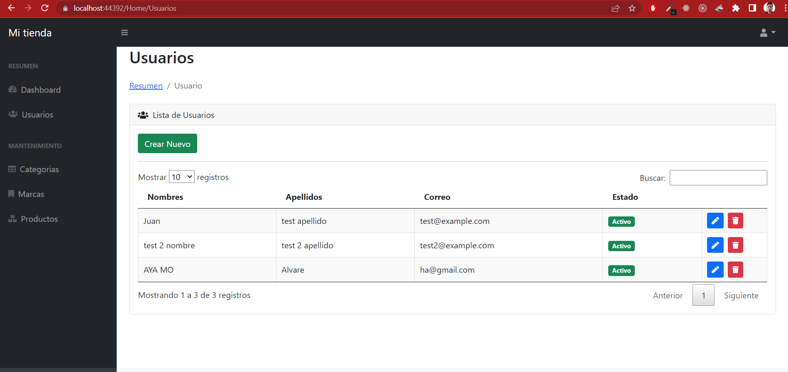
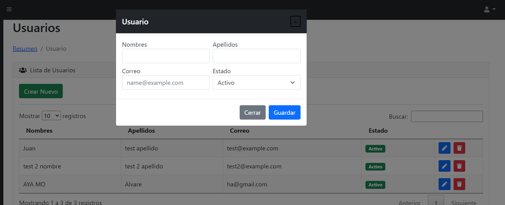
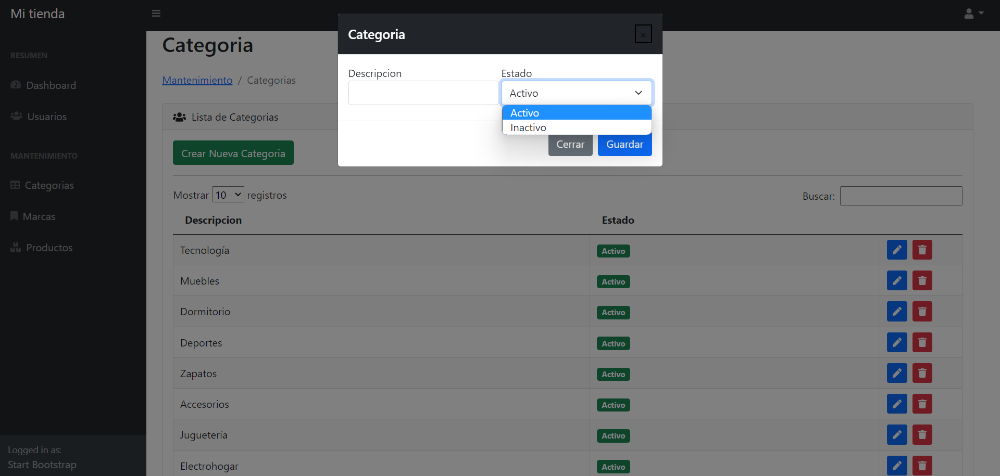
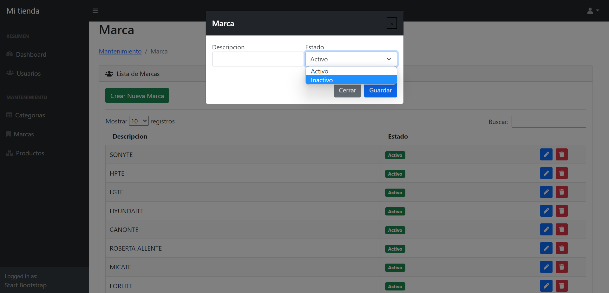
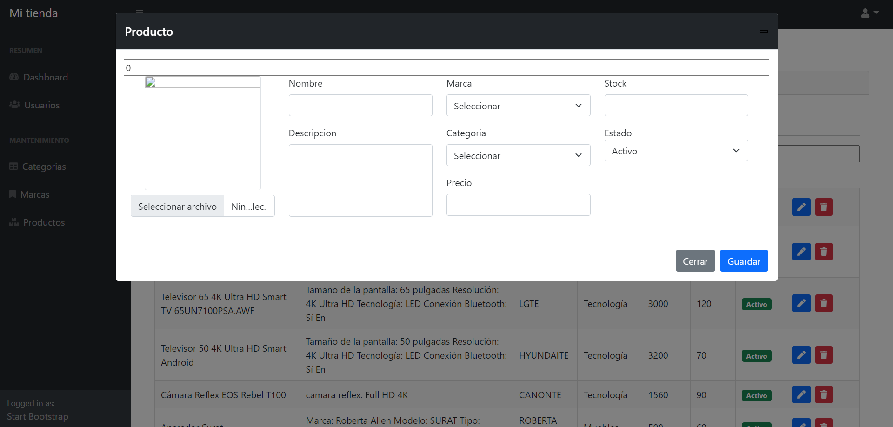
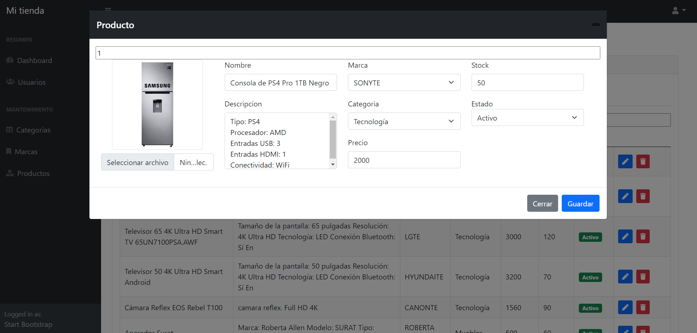

Aca les dejo algunas imagenes del proyecto avanzado

Se visualiza la lista de todo los usuarios usuario

boton crear Nuevo

En categoria, se puede visualizar la lista en la parte de atras

En Marca, se puede visualizar la lista en la parte de atras

En producto, tenemos un espacio para la seleccion de una imagen, los combo box estan unidos a diferente lista

Tenemos un editar producto, donde visualizamos la imagen y los datos

